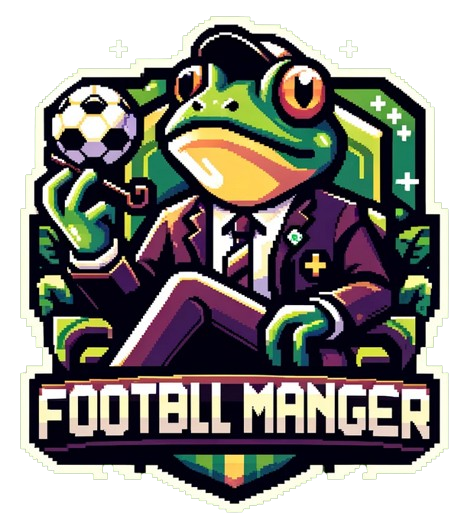

# Ten Taipei Football Manager

⚽ Ten Taipei Football Manager is an on-chain football manager game that leverages the privacy that TEN Protocol provides to hide players' strategies from opponents.

⚙️ Built using Solidity, Hardhat, wagmi, React and Javascript.

- 🧾 **Privacy on TEN**: Players commit to a strategy privately using TEN Protocol.
- ⛓️ **Smart contracts**: Verifies strategies and results of the game.
- ⏱️ **Timelock funds**: The wagered amount is secured by a timelock, to prevents ghosting by losing players.
- 🖼️ **Frontend**: Results are generated in the browser based on strategies.

## Contents

- [Contents](#contents)
- [Game flow](#game-flow)
- [Hackathon bounties](#deployed-contracts)
- [Links](#links)
- [Team](#team)

## Game flow

The game has 3 main steps:

### 1: proposeGame

To start a new game, a challenger calls this functions with 3 parameters:

- opponent (address): Address of the opponent
- wagerAmount (uint256): Amount to be wagered in gwei
- formation (uint256): Array of player_id's

This function creates a game object and stores it in a mapping by gameId. The formation is is stored privately in a seperate mapping.

### 2: acceptGame

To accept a game, an opponent calls this functions with 2 parameters:

- gameId (uint256): Unique id for the game
- formation (uint256): Array of player_id's
  This function publicly stored the opponent's formation in the games mapping.

### 3: revealOutcome

Challenger calls this function to settle a game. The function takes 1 input

- gameId (uint256): Unique id for the game

This function reveals challenger formation, determines the outcome and pays out the winner.

### 3b: revealOutcome

Opponent calls this function to settle a game if the challenger does not call revealOutcome within the timelimit. The function takes 1 input

- gameId (uint256): Unique id for the game

This function is only available after X blocks have passed since acceptGame was executed. It pays out the wagered amounts to the opponent, punishing the challenger for ghosting.

## Deployed contracts

- [TEN deployed contract 0x1e61235A37ee5642d71c6c3f060b6E94b05EE6E7 in tx 0x110cba2a6825baa98798fac3b00e754f33b4c75f7067a1e16b1788103bdee407]()
- [Scroll](https://sepolia.scrollscan.dev/address/0x51BB389e35218E54c3bEEB89Eba750c2a308faD2)
- [Linea](https://goerli.lineascan.build/address/address/0xab2EE87906222B433AF6836b1f1588b79294f67e#code)
- [Optimism](https://sepolia-optimism.etherscan.io/address/0xab2EE87906222B433AF6836b1f1588b79294f67e)
- [Polygon zkEVM cardona](https://cardona-zkevm.polygonscan.com/address/0x072117443ceb3920d9d95d2f005b23fec9e761ad)
- [Thundercore](https://explorer-testnet.thundercore.com/address/0x072117443CEb3920d9D95d2F005b23FeC9E761aD)

## Links

- [Taikai]()
- [Video]()
- [Presentation slides]()

## Team

This project was build at EthTaipei 2024 by:

- [arjanjohan](https://x.com/arjanjohan/)
- [Umut](http://x.com/nhestrompia)
